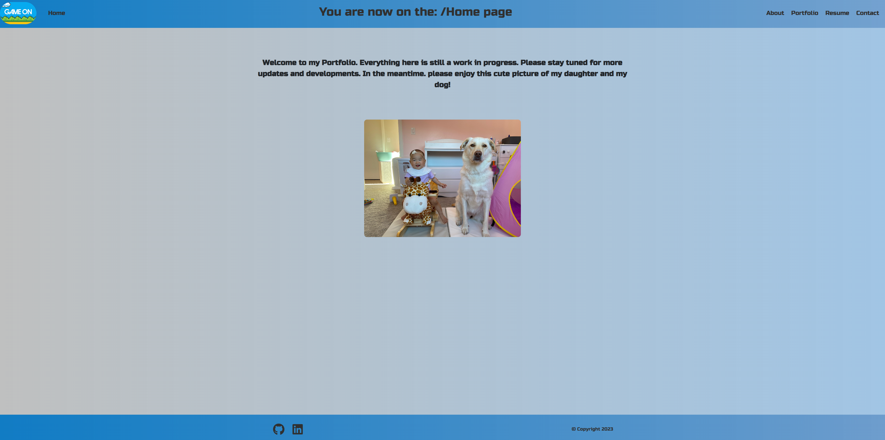
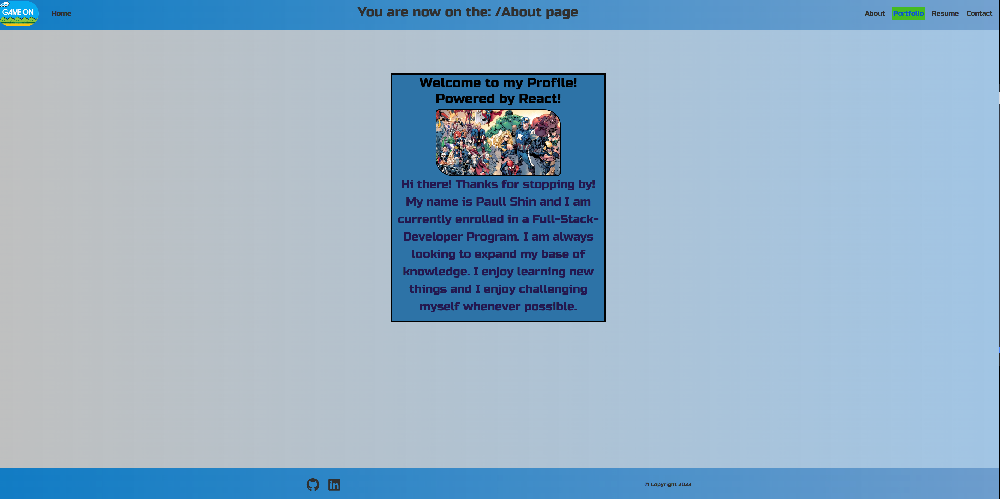
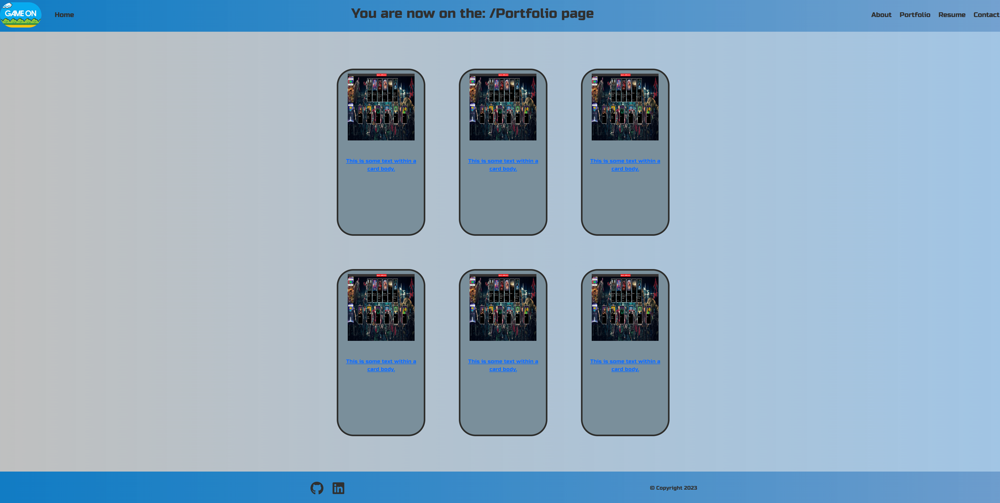
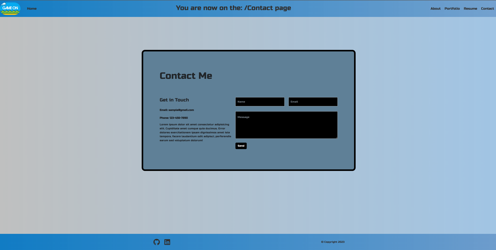

# __React My Portfolio__ 📓

## __Table of Contents__ 📄
* [Overview](#overview-🔎)
* [Installation](#installation-⚙️)
* [Usage](#usage-💻)
* [License](#license-💳)
* [Testing](#testing-📝)
* [Technology](#technology-💡)
* [Contact](#contact-☎)

 

 

## __Overview__ 🔎

This application is a way to showcase my abilities to use React and as well as create a new and better Portfolio for myself!

 

 

 

 

 

 

### __Installation__ ⚙️
​
To use this program the user will need to do an NPM install. This application will utilize Express.

 

 

### __Usage__ 💻
 

* To use this application the user will need to open the application and click on the "Get Started" button. 
* The user will then be taken to a new webpage that will allow the user to input information.
* The user has the ability to enter in a "Title" for their specific note and then after a title is entered in, the user can then add notes to remind them of whatever it is they need to be reminded of.
* Once both inputs have been filled there will be an option to save the notes in the form of a floppy disk icon near the top right corner. 
* Once the user saves their note, it will be displayed on the left hand side with the title as the only thing showing up until they click on it.

 

 

## __License__ 💳
MIT License

Copyright © 2022

Permission is hereby granted, free of charge, to any person obtaining a copy of this software and associated documentation files (the "Software"), to deal in the Software without restriction, including without limitation the rights to use, copy, modify, merge, publish, distribute, sublicense, and/or sell copies of the Software, and to permit persons to whom the Software is furnished to do so, subject to the following conditions:

The above copyright notice and this permission notice shall be included in all copies or substantial portions of the Software.

THE SOFTWARE IS PROVIDED "AS IS", WITHOUT WARRANTY OF ANY KIND, EXPRESS OR IMPLIED, INCLUDING BUT NOT LIMITED TO THE WARRANTIES OF MERCHANTABILITY, FITNESS FOR A PARTICULAR PURPOSE AND NONINFRINGEMENT. IN NO EVENT SHALL THE AUTHORS OR COPYRIGHT HOLDERS BE LIABLE FOR ANY CLAIM, DAMAGES OR OTHER LIABILITY, WHETHER IN AN ACTION OF CONTRACT, TORT OR OTHERWISE, ARISING FROM, OUT OF OR IN CONNECTION WITH THE SOFTWARE OR THE USE OR OTHER DEALINGS IN THE SOFTWARE.

 
​

 

## __Testing__ 📝
All testing was done by myself.

 

 

## __Technology__ 💡

* HTML
* Bootstrap
* CSS
* Javascript
* Express
* Heroku
* React
* Hopes and Dreams

 

 

## __Contact__ ☎

Paull Shin - [Github](https://github.com/paullsshin)
